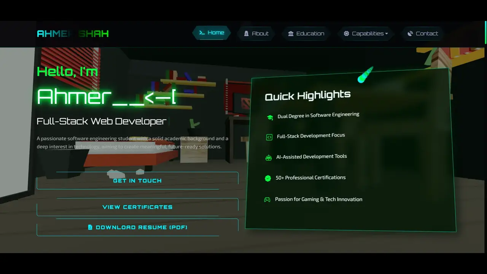

# <div align="center">Ahmer Shah | Software Engineer & Full-Stack Developer ☕</div>

<div align="center">
  
  
  ### Modern, Interactive & Performance-Optimized Portfolio

[](https://ahmershahdev.github.io/Portfolio/)
[](https://ahmershah.dev)
[](./LICENSE)

[](https://github.com/ahmershahdev/Portfolio/commits/)

  <p align="center">
    <a href="#overview">Overview</a> •
    <a href="#features">Features</a> •
    <a href="#tech-stack">Tech Stack</a> •
    <a href="#installation">Installation</a> •
    <a href="#performance">Performance</a> •
    <a href="#connect">Connect</a>
  </p>
</div>

## 🌟 Overview

Hi there! 👋 I'm Ahmer Shah, and I'm excited to welcome you to my portfolio. Here, you'll discover my journey as a Software Engineer and Full-Stack Developer through a modern, interactive web experience. From cutting-edge technologies and 3D animations to performance-driven design, this site is crafted to showcase my skills, projects, and passion for building impactful solutions. Feel free to explore and connect—I'm always open to new ideas and collaborations!

## ✨ Features

### 🎨 Modern Design

- Sleek UI/UX with glass-morphism effects
- Responsive layout optimized for all devices
- Interactive 3D animations using Three.js & Blender (through AI technologies)
- Smooth transitions powered by Anime.js (through AI technologies)

### ⚡ Performance

- Optimized asset loading with lazy loading
- Efficient 3D rendering with hardware acceleration
- Fast load times through code splitting
- SEO optimized with proper meta tags, sitemap.xml, canonical links, and JSON-LD structured data

### 🛠️ Technical

- Dynamic project showcases with AI-enhanced 3D elements
- Interactive skill visualization
- Real-time 3D elements
- Optimized media: WebP images, ICO, lazy loading

## 🔧 Tech Stack

<div align="center">


</div>

## 📦 Installation

1. **Clone the repository**

   ```bash
   git clone https://github.com/ahmershahdev/Portfolio.git
   cd Portfolio
   ```

2. **Open in browser**

   ```bash
   # Simple
   open index.html

   # Using Python
   python -m http.server 8000
   ```

3. **Using VS Code Live Server**
   - Install 'Live Server' extension
   - Right-click on index.html
   - Select 'Open with Live Server'

## 📊 Performance

- **Lighthouse Score**
  - Accessibility: 100
  - Best Practices: 100
  - SEO: 100

## 🤝 Connect

<div align="center">

[](https://www.linkedin.com/in/syedahmershah)
[](https://github.com/ahmershahdev)
[](https://dev.to/syedahmershah)
[](https://medium.com/@syedahmershah)
[](https://hashnode.com/@syedahmershah)
[](https://beacons.ai/syedahmershah)

</div>

## 📬 Contact

- **Email:** support@ahmershah.dev
- **Location:** Pakistan

## 📄 License

This project is proprietary and confidential. All rights reserved.
See [LICENSE](LICENSE.txt) for details.

---

<div align="center">
  
  <br>
 Made with ❤️ and ☕ by Syed Ahmer Shah
  <br>
  © 2026 All Rights Reserved
</div>
